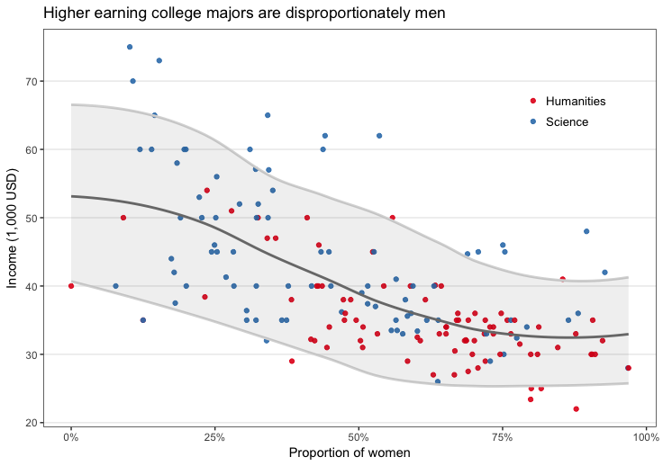
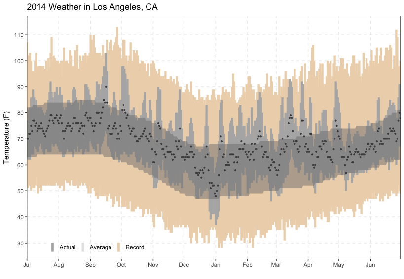

```{r setup, include=FALSE}
knitr::opts_chunk$set(echo = TRUE, eval = FALSE)
```


```{r}
science_giving <- read.csv("science_federal_giving.csv")
attach(science_giving)
library(dplyr)
library(magrittr)
library(tidyr)

x <- science_giving %>%
  group_by(cleanedoccupation, cycle, state, cand_pty_affiliation, classification) %>%
  summarise(n=sum(X2016_dollars),
            ct=n()) %>%
  arrange(desc(n))

x <- x[0:41325,]

gph1 <- x %>%
  group_by(cleanedoccupation, cand_pty_affiliation, classification) %>%
  filter(cand_pty_affiliation %in% c("REP", "DEM")) %>%
  filter(classification %in% c("Engineer", "Scientist")) %>%
  summarise(total = sum(n)) %>%
  arrange(desc(total)) %>%
  ungroup() %>%
  group_by(cand_pty_affiliation, classification) %>%
  top_n(n=7) %>%
  arrange(classification, desc(total))
  
options(scipen = 999)

xdem <- subset(x, cand_pty_affiliation=="DEM")
xrep <- subset(x, cand_pty_affiliation=="REP")
xdem <- subset(xdem, cleanedoccupation %in% xrep$cleanedoccupation)

xrep_group <- xrep %>%
  group_by(cleanedoccupation, cand_pty_affiliation, classification) %>%
  summarise(total = sum(n)) %>%
  arrange(cleanedoccupation)

xdem_group <- xdem %>%
  group_by(cleanedoccupation, cand_pty_affiliation, classification) %>%
  summarise(total = sum(n)) %>%
  arrange(cleanedoccupation)

xrep_group <- subset(xrep_group, cleanedoccupation %in% xdem_group$cleanedoccupation)

xdem_group$difference <- xdem_group$total - xrep_group$total

dem_top <- xdem_group %>%
  arrange(desc(difference))
dem_top <- dem_top[0:13,]
dem_top$party <- "dem"

dem_bottom <- xdem_group %>%
  arrange(difference)
dem_bottom <- dem_bottom[0:13,]
dem_bottom$party <- "rep"
topbottom <- rbind(dem_top, dem_bottom)

plot <- ggplot(data=topbottom, aes(x=reorder(cleanedoccupation, difference), y=difference))+
  geom_col(aes(fill=party))+
  coord_flip()+
  theme_bw(base_size=13)+
  xlab("")+
  ylab("")+
  theme(legend.position = "bottom",
        panel.grid.major.y=element_blank(),
        panel.grid.minor.y=element_blank(),
        panel.grid.minor.x=element_blank(),
        panel.grid.major.x=element_line(color="grey90"),
        axis.ticks = element_line(color="grey90"),
        axis.ticks.y=element_blank(),
        axis.title.x=element_blank(),
        strip.background=element_blank(),
        plot.margin=margin(0.6,0.6,0,0.6, "cm"),
        legend.box.margin=margin(0,0,0,0, "cm"),
        legend.box.spacing=unit(0, "cm"),
        legend.title=element_text(size=11),
        plot.title = element_text(size=12),
        panel.border=element_rect(color="grey60"))+
  ggtitle("Party differences in political donations by scientists, 2008-16")+
  scale_fill_manual(values=c("#377eb8", "#e41a1c"), labels=c("Democrats", "Republicans"), name="Millions of dollars more donated to")+
  scale_y_continuous(expand=c(0,0), limits=c(-2500000,7500000), labels=c("2.5", "0", "2.5", "5.0", "7.5"))
```


```{r}
extra.calendarHeat <- function(dates, 
                               values, 
                               ncolors=99, 
                               color="b2w", 
                               pch.symbol = 15:20,
                               cex.symbol =2,
                               col.symbol ="#00000044",
                               pvalues=values,
                               varname="Values",
                               date.form = "%Y-%m-%d", ...) {
  
  require(latticeExtra) 
  require(grid)
  require(chron)
  
  # Reshape data  ------------------------------------------------------------------ 
  transformdata <- function(dates,  values,pvalues, date.form = "%Y-%m-%d", ...) {
    
    if (class(dates) == "character" | class(dates) == "factor" ) {
      dates <- strptime(dates, date.form)
    }
    caldat <- data.frame( dates = dates,value = values,pvalue=pvalues)
    min.date <- as.Date(paste(format(min(dates), "%Y"),
                              "-1-1",sep = ""))
    max.date <- as.Date(paste(format(max(dates), "%Y"),
                              "-12-31", sep = ""))
    dates.f <- seq(min.date, max.date, by="days")
    
    # Merge moves data by one day, avoid
    caldat <- data.frame(value = values, dates = dates,pvalue=pvalues)
    caldat <- data.frame(date.seq =  seq(min.date, max.date, by="days") , 
                         value = NA,
                         pvalue=NA)
    dates <- as.Date(dates) 
    caldat$value[match(dates, caldat$date.seq)] <- values
    caldat$pvalue[match(dates, caldat$date.seq)] <- pvalues
    caldat$dotw <- as.numeric(format(caldat$date.seq, "%w"))
    caldat$woty <- as.numeric(format(caldat$date.seq, "%U")) + 1
    caldat$yr <- as.factor(format(caldat$date.seq, "%Y"))
    caldat$month <- as.numeric(format(caldat$date.seq, "%m"))
    yrs <- as.character(unique(caldat$yr))
    d.loc <- as.numeric()                        
    for (m in min(yrs):max(yrs)) {
      d.subset <- which(caldat$yr == m)  
      sub.seq <- seq(1,length(d.subset))
      d.loc <- c(d.loc, sub.seq)
    }  
    
    caldat <- cbind(caldat, seq=d.loc)
    caldat$pvalue.n <- round(caldat$pvalue/max(caldat$pvalue,na.rm=T),2)
    caldat
    
    
  }
  
  dat <- transformdata(dates, values,pvalues,date.form)
  
  
  ## color style -----------------------------------------
  #color styles------------------------------------------------
  
  col.sty <- switch(color,
                    "r2b"=c("#0571B0", "#92C5DE", "#F7F7F7", "#F4A582", "#CA0020"), #red to blue                                                                               
                    'r2g'=c("#D61818", "#FFAE63", "#FFFFBD", "#B5E384")  , #red to green
                    'w2b'=c("#045A8D", "#2B8CBE", "#74A9CF", "#BDC9E1", "#F1EEF6"),   #white to blue
                    'b2w'=grey.colors(5) )## black to white
  # assign("col.sty", get(color))
  calendar.pal <- colorRampPalette((col.sty), space = "Lab")
  
  
  ## scales ------------------------------------------------------------------  
  
  yrs <- (unique(dat$yr))
  nyr <- length(yrs)
  
  scales = list(
    x = list( at= c(seq(2.9, 52, by=4.42)),
              labels = month.abb,
              alternating = c(1, rep(0, (nyr-1))),
              tck=0,
              cex =1),
    y=list(
      at = c(0, 1, 2, 3, 4, 5, 6),
      labels = c("Sunday", "Monday", "Tuesday", "Wednesday", "Thursday",
                 "Friday", "Saturday"),
      alternating = 1,
      cex =1,
      tck=0))
  
  # theme ------------------------------------------------------------------  
  calendar.theme <- list(
    xlab=NULL,ylab=NULL,
    strip.background = list(col = "transparent"),
    strip.border = list(col = "transparent"),
    axis.line = list(col="transparent"),
    par.strip.text=list(cex=2))
  
  
  #calendar divsion-----------------------------------------------------------------------  
  calendar.division <- function(...)
  {
    xyetc <- list(...)
    subs <- dat[xyetc$subscripts,]
    dates.fsubs <- dat[dat$yr == unique(subs$yr),]
    y.start <- dates.fsubs$dotw[1]
    y.end   <- dates.fsubs$dotw[nrow(dates.fsubs)]
    dates.len <- nrow(dates.fsubs)
    adj.start <- dates.fsubs$woty[1]
    
    
    for (k in 0:6) {
      if (k < y.start) {
        x.start <- adj.start + 0.5
      } else {
        x.start <- adj.start - 0.5
      }
      if (k > y.end) {
        x.finis <- dates.fsubs$woty[nrow(dates.fsubs)] - 0.5
      } else {
        x.finis <- dates.fsubs$woty[nrow(dates.fsubs)] + 0.5
      }
      grid.lines(x = c(x.start, x.finis), y = c(k -0.5, k - 0.5), 
                 default.units = "native", gp=gpar(col = "grey", lwd = 1))
    }
    if (adj.start <  2) {
      grid.lines(x = c( 0.5,  0.5), y = c(6.5, y.start-0.5), 
                 default.units = "native", gp=gpar(col = "grey", lwd = 1))
      grid.lines(x = c(1.5, 1.5), y = c(6.5, -0.5), default.units = "native",
                 gp=gpar(col = "grey", lwd = 1))
      grid.lines(x = c(x.finis, x.finis), 
                 y = c(dates.fsubs$dotw[dates.len] -0.5, -0.5), default.units = "native",
                 gp=gpar(col = "grey", lwd = 1))
      if (dates.fsubs$dotw[dates.len] != 6) {
        grid.lines(x = c(x.finis + 1, x.finis + 1), 
                   y = c(dates.fsubs$dotw[dates.len] -0.5, -0.5), default.units = "native",
                   gp=gpar(col = "grey", lwd = 1))
      }
      grid.lines(x = c(x.finis, x.finis), 
                 y = c(dates.fsubs$dotw[dates.len] -0.5, -0.5), default.units = "native",
                 gp=gpar(col = "grey", lwd = 1))
    }
    for (n in 1:51) {
      grid.lines(x = c(n + 1.5, n + 1.5), 
                 y = c(-0.5, 6.5), default.units = "native", gp=gpar(col = "grey", lwd = 1))
    }
    x.start <- adj.start - 0.5
    
    if (y.start > 0) {
      grid.lines(x = c(x.start, x.start + 1),
                 y = c(y.start - 0.5, y.start -  0.5), default.units = "native",
                 gp=gpar(col = "black", lwd = 1.75))
      grid.lines(x = c(x.start + 1, x.start + 1),
                 y = c(y.start - 0.5 , -0.5), default.units = "native",
                 gp=gpar(col = "black", lwd = 1.75))
      grid.lines(x = c(x.start, x.start),
                 y = c(y.start - 0.5, 6.5), default.units = "native",
                 gp=gpar(col = "black", lwd = 1.75))
      if (y.end < 6  ) {
        grid.lines(x = c(x.start + 1, x.finis + 1),
                   y = c(-0.5, -0.5), default.units = "native",
                   gp=gpar(col = "black", lwd = 1.75))
        grid.lines(x = c(x.start, x.finis),
                   y = c(6.5, 6.5), default.units = "native",
                   gp=gpar(col = "black", lwd = 1.75))
      } else {
        grid.lines(x = c(x.start + 1, x.finis),
                   y = c(-0.5, -0.5), default.units = "native",
                   gp=gpar(col = "black", lwd = 1.75))
        grid.lines(x = c(x.start, x.finis),
                   y = c(6.5, 6.5), default.units = "native",
                   gp=gpar(col = "black", lwd = 1.75))
      }
    } else {
      grid.lines(x = c(x.start, x.start),
                 y = c( - 0.5, 6.5), default.units = "native",
                 gp=gpar(col = "black", lwd = 1.75))
    }
    
    if (y.start == 0 ) {
      if (y.end < 6  ) {
        grid.lines(x = c(x.start, x.finis + 1),
                   y = c(-0.5, -0.5), default.units = "native",
                   gp=gpar(col = "black", lwd = 1.75))
        grid.lines(x = c(x.start, x.finis),
                   y = c(6.5, 6.5), default.units = "native",
                   gp=gpar(col = "black", lwd = 1.75))
      } else {
        grid.lines(x = c(x.start + 1, x.finis),
                   y = c(-0.5, -0.5), default.units = "native",
                   gp=gpar(col = "black", lwd = 1.75))
        grid.lines(x = c(x.start, x.finis),
                   y = c(6.5, 6.5), default.units = "native",
                   gp=gpar(col = "black", lwd = 1.75))
      }
    }
    for (j in 1:12)  {
      last.month <- max(dates.fsubs$seq[dates.fsubs$month == j])
      x.last.m <- dates.fsubs$woty[last.month] + 0.5
      y.last.m <- dates.fsubs$dotw[last.month] + 0.5
      grid.lines(x = c(x.last.m, x.last.m), y = c(-0.5, y.last.m),
                 default.units = "native", gp=gpar(col = "black", lwd = 1.75))
      if ((y.last.m) < 6) {
        grid.lines(x = c(x.last.m, x.last.m - 1), y = c(y.last.m, y.last.m),
                   default.units = "native", gp=gpar(col = "black", lwd = 1.75))
        grid.lines(x = c(x.last.m - 1, x.last.m - 1), y = c(y.last.m, 6.5),
                   default.units = "native", gp=gpar(col = "black", lwd = 1.75))
      } else {
        grid.lines(x = c(x.last.m, x.last.m), y = c(- 0.5, 6.5),
                   default.units = "native", gp=gpar(col = "black", lwd = 1.75))
      }
    }
  }
  
  # major plot ------------------------------------------------------------------
  
  p <- levelplot(value~woty*dotw | yr, data=dat, border = "black",
                 layout = c(1, nyr%%7),
                 col.regions = calendar.pal(ncolors),
                 aspect='iso',
                 between = list(x=0, y=c(1,1)),
                 strip=TRUE,
                 main =varname, 
                 panel = function(x,y,z,...) {
                   panel.levelplot(x,y,z,...)
                   ll <- list(...)
                   at = pretty(dat$pvalue)
                   ind.pch <- cut(dat$pvalue, at, include.lowest = TRUE, labels = FALSE)
                   pch.symbols <- pch.symbol[ind.pch]
                   subscripts <- ll$subscripts
                   x <- x[subscripts]
                   y <- y[subscripts]
                   pch.symbols <-  pch.symbols[subscripts]
                   panel.xyplot(x, y, fill =col.symbol ,col.symbol =col.symbol,
                                pch = pch.symbols, cex=cex.symbol,
                                ,  ...)
                   calendar.division(...)  
                 },
                 scales= scales,
                 xlim =extendrange(dat$woty,f=0.01),
                 xlab="",ylab="",
                 ylim=extendrange(dat$dotw,f=0.1),
                 cuts= ncolors - 1,
                 colorkey= list(col = calendar.pal(ncolors), width = 0.6, height = 0.5),
                 subscripts=TRUE,
                 par.settings = calendar.theme)
  p
}

##----------- example---------------------------------------------------

p1 <- extra.calendarHeat(dates= mydatamile$X_startDate, values = mydatamile$n,
                         varname="How many miles I walked each day", color="r2b", pch.symbol=15)
```


```{r}
library(ggplot2)
library(lubridate)
library(dplyr)
library(magittr)

mydata <- read.csv("convertcsv.csv")
mydatacount <- subset(mydata, X_unit=="count")

mydatacount$X_startDate <- lubridate::as_datetime(mydatacount$X_startDate)
mydatacount$X_value <- as.numeric(mydatacount$X_value)

mydatahourly <- mydatacount %>%
  group_by(rounded_hour = floor_date(X_startDate, unit="hour")) %>%
  summarise(hourly_sum=sum(as.numeric(as.character(X_value))))

mydatacount$hour <- hour(mydatacount$X_startDate)
mydatacount$minute <- minute(mydatacount$X_startDate)
mydatacount$month <- month(mydatacount$X_startDate)
mydatacount$year <- year(mydatacount$X_startDate)

mydatacount <- subset(mydatacount, year==2017)
mydatacount$bin <- 0

mydatacount$bin[mydatacount$minute <= 29 & mydatacount$minute >= 0] <- 1
mydatacount$bin[mydatacount$minute <= 59 & mydatacount$minute >= 30] <- 2
mydatacount$degree <- mydatacount$bin * (mydatacount$hour+1)


graph_data <- mydatacount %>%
  group_by(hour, month) %>%
  summarise(n=sum(as.numeric(as.character(X_value))))

graph_data$mm <- 0
graph_data$mm[graph_data$month == 1] <- "Jan"
graph_data$mm[graph_data$month == 2] <- "Feb"
graph_data$mm[graph_data$month == 3] <- "Mar"
graph_data$mm[graph_data$month == 4] <- "Apr"
graph_data$mm[graph_data$month == 5] <- "May"
graph_data$mm[graph_data$month == 6] <- "Jun"
graph_data$mm[graph_data$month == 7] <- "Jul"
graph_data$mm[graph_data$month == 8] <- "Aug"
graph_data$mm[graph_data$month == 9] <- "Sept"
graph_data$mm[graph_data$month == 10] <- "Oct"
graph_data$mm[graph_data$month == 11] <- "Nov"

graph_data$mm <- ordered(graph_data$mm, levels=c("Jan", "Feb", "Mar", "Apr", "May", "Jun", "Jul", "Aug", "Sept", "Oct", "Nov"))

averages <- graph_data %>%
  group_by(hour) %>%
  summarise(n=mean(n))

circle1 <- ggplot(data=graph_data, aes(x=hour, y=n))+
  geom_area(data=averages,aes(x=hour,y=n), color="grey70", fill="grey70")+
  geom_line()+
  theme_bw()+
  facet_wrap(~mm, nrow=3)+
  geom_vline(xintercept=12, linetype="dashed", color="grey30")+
  theme(strip.background = element_blank(),
        panel.grid.minor.x=element_blank(),
        panel.grid.minor.y=element_blank(),
        panel.border=element_rect(color="grey30"))+
  scale_x_continuous(breaks=c(0,3,6,9,12,15,18,21), labels=c("0","","6 am","","12","","6 pm",""))+
  scale_y_continuous(breaks=c(0,15000,30000,45000), labels=c("0","15,000", "30,000", "45,000"))+
  ggtitle("Number of steps I took at each hour of the day, Jan-Nov 2017")+
  ylab("")+
  xlab("")

print(circle1)

require(dplyr)
mydatamile <- mydata %>%
  filter(X_unit=="mi")

require(lubridate)
mydatamile$X_startDate <- as_datetime(mydatamile$X_startDate)
mydatamile$X_startDate <- floor_date(mydatamile$X_startDate, unit="day")

mydatamile <- mydatamile %>%
  group_by(X_startDate) %>%
  summarise(n=sum(as.numeric(as.character(X_value))))
```


```{r}
ozone <- read.csv("indexed_data.csv")
ozone_data <- ozone %>%
  filter(age_group == "total") %>%
  filter(Pollutant == "NO2") %>%
  group_by(date, provinces) %>%
  summarise(ozone = mean(Concentration), temp = mean(Temp_C))


ozone_data$date <- as.Date(ozone_data$date, format='%Y-%m-%d')

ozone_data <- ozone_data %>%
  arrange(date)
ozone_data <- ozone_data[0:2862,]

ozone_data <- subset(ozone_data, !(provinces %in% c("Malaga", "Murcia")))

dateplot <- ggplot(data=ozone_data, aes(x=date, y=ozone))+
  geom_line(aes(group=provinces), alpha=0.2, color="grey30")+
  geom_line(data=subset(ozone_data, provinces=="Madrid"), color="red")+
  theme_bw()+
  ylab(expression(paste("Nitrogen dioxide ", ug/m^3)))+
  xlab("")+
  theme(panel.grid.minor.y=element_blank(),
    legend.title=element_blank(),
    legend.position=c(0.75,1.06),
    panel.grid.major.y=element_blank(),
    panel.grid.minor.x=element_blank(),
    axis.ticks = element_line(color="grey90"))+
  scale_x_date(expand=c(0,0), date_breaks = "1 month", date_labels = "%b")+
  ggtitle("Nitrogen dioxide concentrations are higher in Madrid than in the rest of Spain")
```



